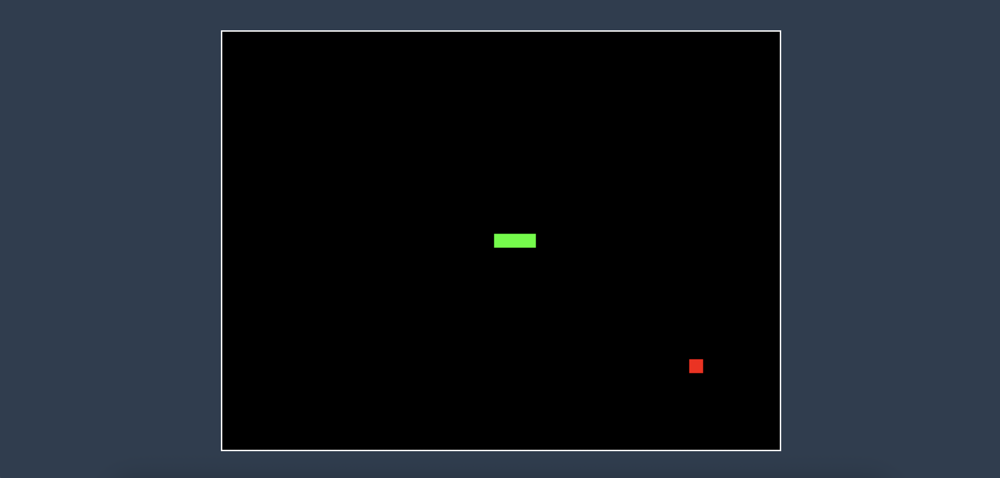

# Phaser Snake Game

A classic Snake game built with Phaser.js 3.

🎮 [Play the game](https://can-guven.github.io/phaser-js-snake/)



## Setup

1. Install dependencies:

```bash
npm install
```

2. Start the development server:

```bash
npm start
```

3. Open your browser and navigate to `http://localhost:1234`

## How to Play

- Use the arrow keys to control the snake's direction
- Collect the red food blocks to grow longer
- Avoid hitting the walls or yourself
- The game will restart if you crash

## Game Features

- Classic snake gameplay mechanics
- Smooth controls with arrow keys
- Score tracking through snake length
- Instant restart on game over
- Clean and minimalist design

## Development

- The game is built using Phaser.js 3
- Uses Parcel as the bundler
- Source code is in the `src` directory

## Building for Production

To create a production build:

```bash
npm run build
```

The built files will be in the `dist` directory.

## Deployment

The game is automatically deployed to GitHub Pages when changes are pushed to the main branch. You can also manually deploy using:

```bash
npm run deploy
```

Visit the live game at: https://can-guven.github.io/phaser-js-snake/
